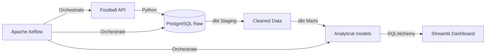

# 🏆 Premier League Insights: End-to-End Data Engineering Pipeline

An automated, professional-grade ELT (Extract-Load-Transform) pipeline that fetches football match data, transforms it using industrial standards, orchestrates with Airflow, and visualizes through a Streamlit dashboard.

---

## 🏗️ Architecture


## 🛠️ Tech Stack
- **Languages**: Python 3.12, SQL
- **Database**: PostgreSQL 15
- **Transformation**: dbt (Data Build Tool)
- **Orchestration**: Apache Airflow
- **Visualization**: Streamlit, Plotly
- **Infrastructure**: Docker & Docker Compose

## 🚀 Key Features
- **Automated ELT**: Daily automated extraction of Premier League match results.
- **Silver/Gold Architecture**: Data is cleaned in staging and aggregated in fact tables based on dbt best practices.
- **Real-time Standings**: Dynamic calculation of league points (Wins=3, Draws=1, Loss=0).
- **Interactive Dashboard**: Metrics and charts for team performance analysis.
- **Enterprise Ready**: Full environment variable support and containerized deployment.

## 🏁 How to Run
1. **Prerequisites**: Docker & Docker Compose installed.
2. **Setup**: 
   - Clone the repository.
   - Rename `.env.example` to `.env` and fill in your API key.
3. **Launch Infrastructure**:
   ```bash
   docker-compose up -d
   ```
4. **Run Application**:
   ```bash
   .venv/Scripts/streamlit run scripts/app.py
   ```
5. **Access Airflow**: Visit `http://localhost:8080` (admin / your_password)

---
**Data Engineering Practice Project**
